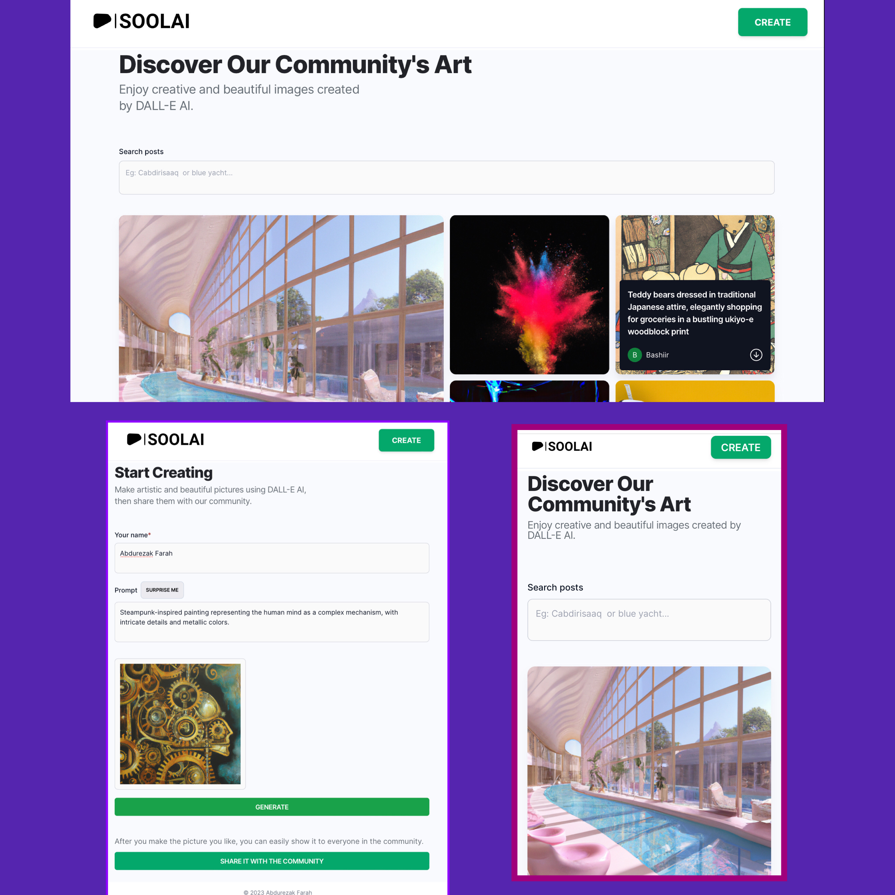

<a name="readme-top"></a>
<div align="center">

  
  

  <h1>SoolAI — AI Image generator</h1>
  
  <p>
   SoolAI is a powerful AI image generator inspired by MidJourney & DALL·E, offering a seamless Full Stack MERN experience. Create stunning AI-generated images from prompts, share your creations with the community, and explore the artistic wonders of artificial intelligence. Built with TypeScript, ReactJS, Tailwind CSS, Node.js, Express.js, MongoDB, and the DALL·E model.
  </p>
  
 <h4>
    <a href="https://soolai.netlify.app/">View Demo</a>
  <span> · </span>
    <a href="https://github.com/awelrisak/soolai">Documentation</a>
  <span> · </span>
    <a href="https://github.com/awelrisak/soolai/issues/">Report Bug</a>
  <span> · </span>
    <a href="https://github.com/awelrisak/soolai/issues/">Request Feature</a>
  </h4>
  


## Features

- **Community Showcase**: Explore the incredible creations of the Sool AI community.

- **Create AI Images**: Generate captivating AI images using prompts and the DALL·E model.

- **Share Your Creations**: Share your AI-generated masterpieces with the Sool AI community.


</div> 


<br />

<!-- Table of Contents -->
<details>

<summary>

# :notebook_with_decorative_cover: Table of Contents

</summary>

- [About the Project](#star2-about-the-project)
  * [Folder Structure](#bangbang-folder-structure)
  * [Tech Stack](#space_invader-tech-stack)

</details>  

<!-- About the Project -->
## :star2: About the Project

<div align="center">
  
</div>

<br />

<!-- Folder Structure -->
### :bangbang: Folder Structure

Here is the folder structure of SoolAI .
```bash
SoolAI/
|-client/
  |-- public/
  |-- src/
    |---assets/
    |---api/
    |--- components/
    |--- constants/
    |--- layouts/
    |---utils/
    |--- routes/
    |---app.jsx
    |--- router.js
    |--- index.css
    |--- main.jsx    
  |-- postcss.config.cjs
  |--tailwind.config.cjs
  |-- vite.config.js
|-server/
  |--src/
    |---mongodb/
    |---routes/
    |---index.ts
  |--nodemon.json
  |--package.json
  |--tsconfig.json
```
<br />

<!-- TechStack -->
### :space_invader: Technologies Used

[](https://skillicons.dev)


- TypeScript: A statically typed superset of JavaScript.

- ReactJS: A popular JavaScript library for building user interfaces.

- Tailwind CSS: A utility-first CSS framework for rapid UI development.

- Node.js: A JavaScript runtime for building server-side applications.

- Express.js: A minimal and flexible Node.js web application framework.

- MongoDB: A NoSQL database for storing and managing data.

- Mongoose: An elegant MongoDB object modeling for Node.js.

- DALL·E: A language model for generating images from text descriptions.

<p align="right">(<a href="#readme-top">back to top</a>)</p>


<!-- Contact -->
## :handshake: Contact

Abdurezak Farah - [@awelrisak](https://twitter.com/awelrisak) - [@awelrisak](https://t.me/awelrisak)

Project Link: [https://github.com/awelrisak/soolai](https://github.com/awelrisak/hoobal)

##Acknowledgments

<p>
I am grateful for the inspiration from MidJourney and the incredible capabilities of the DALL·E model.
</p>

<p align="right">(<a href="#readm-top">back to top</a>)</p>


